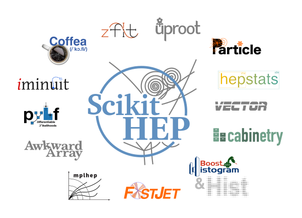

# Tutorial de Scikit-HEP

Este es un tutorial sobre [Scikit-HEP](https://scikit-hep.org), una colección de paquetes para el análisis de física de partículas en Python.

Fue escrito por [Jim Pivarski][jpivarski] (originalmente en inglés [aquí](https://hsf-training.github.io/hsf-training-scikit-hep-webpage/index.html), traducido por [Andrés Ríos Tascón](https://github.com/ariostas)) y se enseñó por primera vez durante un [Taller de Software Carpentry](https://indico.cern.ch/event/1097111/timetable/#day-2021-12-15) el 15 de diciembre de 2021. La versión original en inglés se puede encontrar [aquí](https://github.com/hsf-training/hsf-training-scikit-hep-webpage).

¡Este repositorio genera una página web que está disponible [aquí](https://hsf-training.github.io/hsf-training-scikit-hep-webpage/)!

El tutorial de Scikit-HEP es parte del [currículo de formación del HSF](https://hepsoftwarefoundation.org/training/curriculum).

## Contribuciones

¡Damos la bienvenida a todas las contribuciones para mejorar el tutorial! Los mantenedores harán todo lo posible por ayudarte si tienes alguna pregunta, inquietud o experimentas alguna dificultad durante el proceso.

Nos gustaría pedirte que te familiarices con nuestra [Guía de Contribuciones](CONTRIBUTING.md) y revises las [directrices más detalladas][lesson-example] sobre el formato adecuado, cómo renderizar la lección localmente e incluso cómo escribir nuevos episodios.

## Mantenedores

* [Andres Rios Tascon][ariostas]

## Autores

Una lista de los colaboradores de la lección se puede encontrar en [AUTORES](AUTHORS).

## Citación

Para citar este tutorial, consulta con [CITATION](CITATION).

[lesson-example]: https://carpentries.github.io/lesson-example
[jpivarski]: https://github.com/jpivarski/
[carpentries]: https://software-carpentry.org/
[ariostas]: https://github.com/ariostas/
