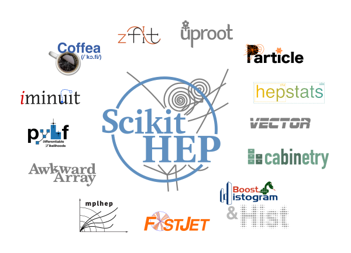

# Tutorial de Scikit-HEP

Este es un tutorial sobre [Scikit-HEP](https://scikit-hep.org), una colección de paquetes para el análisis de física de partículas en Python.

Fue escrito por [Jim Pivarski][jpivarski] y se enseñó por primera vez durante un [Taller de Software Carpentry](https://indico.cern.ch/event/1097111/timetable/#day-2021-12-15) el 15 de diciembre de 2021.

Esta es la traducción al español, hecha por [Andrés Ríos Tascón][ariostas], de la [versión original en inglés](https://hsf-training.github.io/hsf-training-scikit-hep-webpage/).

¡Este repositorio genera una página web que está disponible [aquí](https://hsf-training.github.io/hsf-training-scikit-hep-webpage-es/)!

El tutorial de Scikit-HEP es parte del [currículo de formación del HSF](https://hsf-training.org/training-center/).

**Prerrequisitos:** conocimiento básico de Python, por ejemplo, a través de la lección [Análisis y visualización de datos usando Python](https://datacarpentry.org/python-ecology-lesson-es/).

## Contribuciones

¡Damos la bienvenida a todas las contribuciones para mejorar el tutorial! Los mantenedores harán todo lo
posible por ayudarte si tienes alguna pregunta, inquietud o experimentas alguna dificultad durante el proceso.

Nos gustaría pedirte que te familiarices con nuestra [Guía de Contribuciones](CONTRIBUTING.md) para más detalles.

## Mantenedores

* [Andrés Ríos Tascón][ariostas]

## Autores

Una lista de los colaboradores de la lección se puede encontrar en [AUTHORS](https://github.com/hsf-training/hsf-training-scikit-hep-webpage-es/blob/main/AUTHORS)

## Citación

Para citar este tutorial, consulta el archivo [CITATION.cff](https://github.com/hsf-training/hsf-training-scikit-hep-webpage-es/blob/main/CITATION.cff), o usa el botón "Cite this repository" en la barra lateral.

[jpivarski]: https://github.com/jpivarski/
[ariostas]: https://github.com/ariostas/
